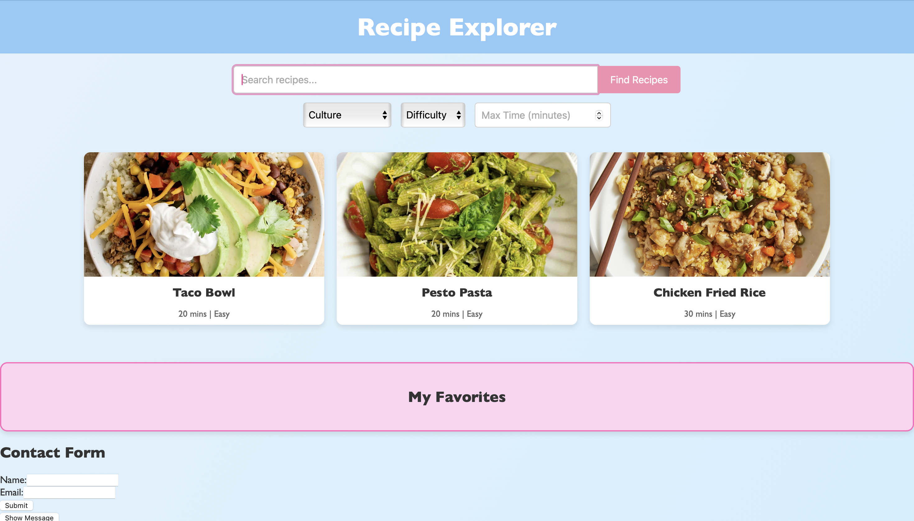
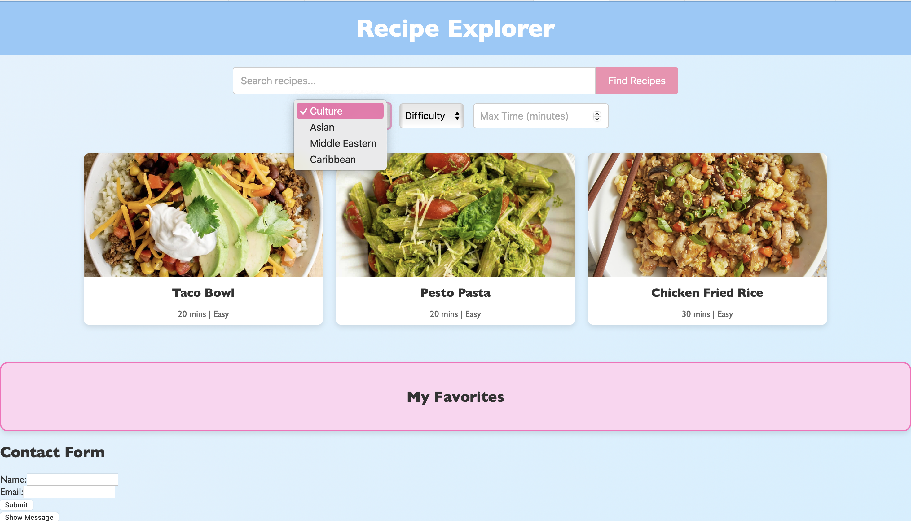
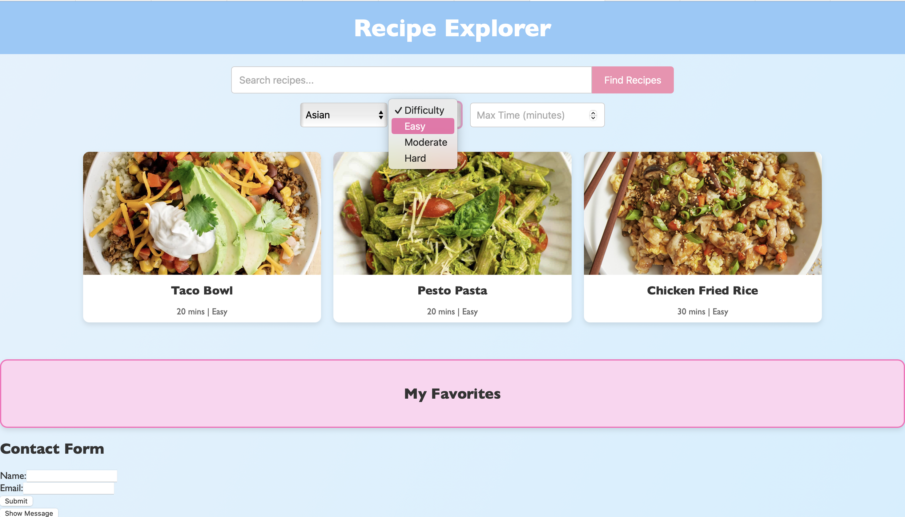
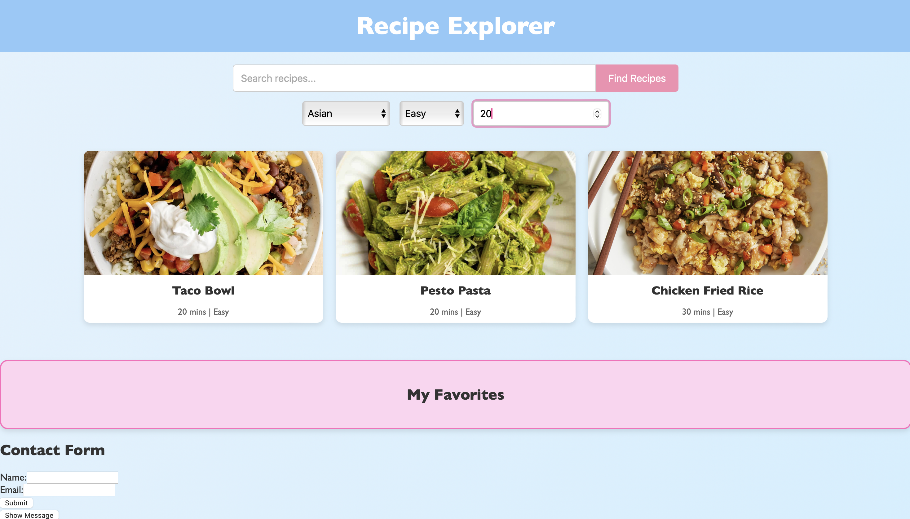
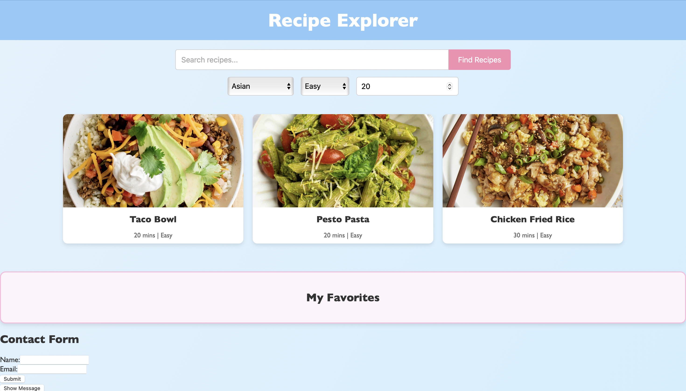
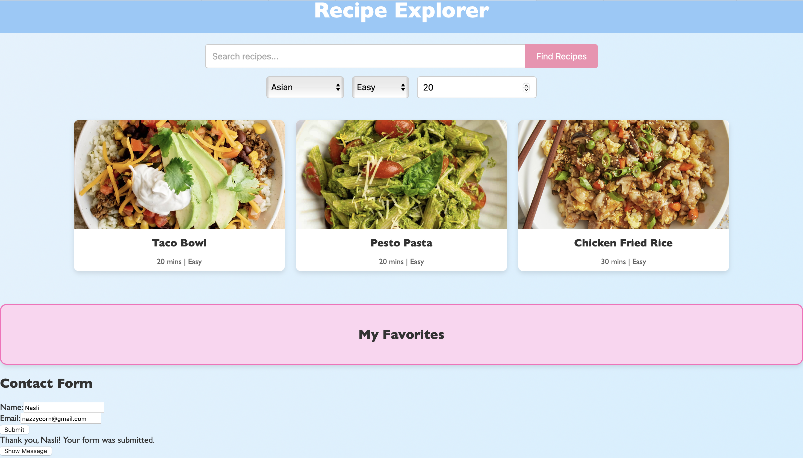

# group-recipe-project
For this project, we are creating an interactive recipe website. Our website is aimed at anyone and everyone who enjoys cooking and those who wish to learn how to cook. We plan to have features that make it easier to filter through different recipes via cultures, ingredients, difficulty and time.
## Features of Recipe Website
1. **Search Bar**
   - Search recipes by ingredients or meal names like "chicken" or "pasta"
2. **Filtering Options**
   - **Cultures:** Asian, Caribbean, Middle Eastern
   - **Difficulty Level:** Easy, Medium, Hard 
   - **Cooking Time:** Filter recipes by max cooking time
3. **Favourites Section**
   - Save your favourite recipes for quick access
4. **Contact Form**
   - Share feedback or suggestions through a simple form
# Team Members and Contributions
- Kerlan Augustine: Team leader, HTML developer, Github manager
- Naslihan Mohammed Ayoub: CSS developer, Code reviewer
- Caleb Berkoh: Javascript developer
# Documentation
- Issues Board: https://github.com/KerlanHumber/group-recipe-project/issues
- Project Board: https://github.com/users/KerlanHumber/projects/1
- Youtube Video:  [/0.jpg)](https://www.youtube.com/watch?v=(https://youtu.be/kMc-gl05_zY))

---
### Screenshots of Features

